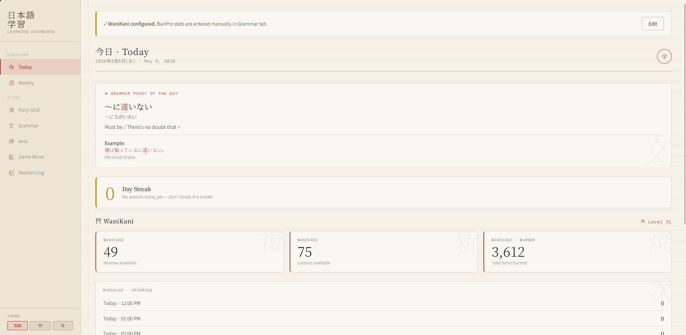

# 日本語 Dashboard

A personal Japanese learning dashboard. Pulls together WaniKani, Anki, and Game Sentence Miner stats in one place, with a Jōyō kanji grid, Jisho lookups, and a clean Japanese aesthetic.

Built for myself. Sharing because others might find it useful.



## What's in it

- WaniKani review counts, lessons, level, burned items, upcoming reviews
- Anki integration via AnkiConnect — per-deck stats with arrow navigation, today's review count, weekly activity
- BunPro stats (entered manually, since their public API isn't out yet)
- All 2,136 Jōyō kanji in a clickable grid, filterable by JLPT level
- Click any kanji to see readings, meaning, and common words pulled live from Jisho
- Game Sentence Miner CSV import with per-game breakdown
- Daily grammar point, session log, weekly time tracking
- Two themes: washi paper (light) and dark

Everything stores locally in your browser. Nothing leaves your machine except calls to the official APIs (WaniKani, Anki, Jisho).

## Quick start (Windows)

1. Download the latest release zip from [Releases](../../releases) and unzip
2. Make sure Anki is open with the [AnkiConnect add-on](https://ankiweb.net/shared/info/2055492159) installed
3. Add `http://localhost:8080` to AnkiConnect's CORS list (see [setup.md](docs/setup.md))
4. Double-click `Nihongo Dashboard.exe`
5. The dashboard opens in your browser. A small red 日 icon also appears in your system tray.
6. Click the gear icon in the dashboard → paste your WaniKani token

The exe runs quietly in the system tray. Click the tray icon any time to open the dashboard. Right-click for options: **Start with Windows** (auto-launch on boot) and **Quit**.

That's it.

## Disclaimer

> This is a third-party app and is not created or managed by the WaniKani team. By using it, you understand that it can stop working at any time or be discontinued indefinitely.

## Requirements

- Windows 10 or 11 (for the bundled exe — Mac/Linux can run from source)
- Anki + AnkiConnect (optional but recommended)
- WaniKani API token (free, optional)
- Browser (Firefox or Chrome both work; Firefox tested most)

## Getting your API keys

**WaniKani**: [wanikani.com/settings/personal_access_tokens](https://www.wanikani.com/settings/personal_access_tokens) → generate a token. Read-only is fine.

**AnkiConnect**: No key, but you do need to whitelist `http://localhost:8080` in its config. See [setup.md](docs/setup.md).

**BunPro**: Their public API isn't released yet — enter stats manually in the Grammar tab.

## Running from source

```bash
git clone https://github.com/TrumanatShow/nihongo-dashboard
cd nihongo-dashboard
python3 server.py
```

Python 3.9+. No dependencies — uses only the standard library.

## Building the .exe

```
build.bat
```

Requires Python and PyInstaller. Outputs `dist/Nihongo Dashboard.exe`.

## Contributing

Issues and PRs welcome. See [CONTRIBUTING.md](CONTRIBUTING.md).

## License

GPL-3.0. See [LICENSE](LICENSE).

## Credits

Built on top of [WaniKani](https://wanikani.com), [Jisho.org](https://jisho.org), and [AnkiConnect](https://github.com/FooSoft/anki-connect). Kanji and word data via Jisho.org, which sources from JMdict and KANJIDIC2 (CC BY-SA 4.0).
